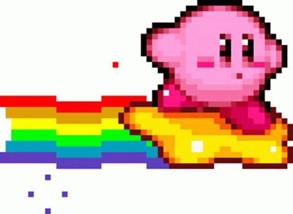
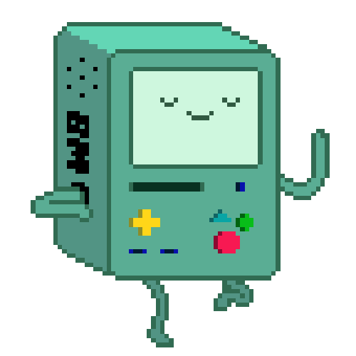

  

  

  

   

  

    <i>
      Recolectando ideas extrañas, sobreviviendo bugs 
      and turning tiny side quests into questionable software.
    </i>
  

  

    
    
    
  

 

 

- 📱 Creando aplicaciones que idealmente no exploten.
- 🔮 Learning Kotlin, Android and computer vision.
- 🎨 Dibujando criaturas y cosas medio esperpénticas.
- 🧪 Experimentando con interfaces, colores y detalles innecesarios.
- 🐯 Protegiendo a este tigre de los horrores de producción.
- ⭐ Accepting suspicious side quests since forever.
- 🪄 Convirtiendo errores inexplicables en experiencia profesional.

 

 

 

  

    

  
  
  
  
  
  

    

 

  

  

   

  <code>PLAYER ONE IS STILL DEBUGGING</code>

  

